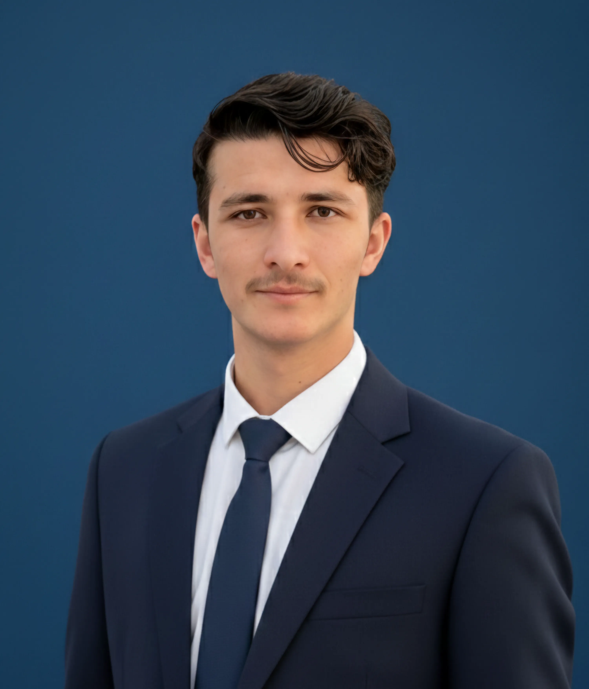

<div align="center">

# 🔐 Abdul Salam — Cybersecurity Portfolio

<p>
  <b>Cybersecurity Enthusiast • Python Developer • Secure Systems Builder</b>
</p>

<p>
  <a href="https://www.linkedin.com/in/abdul-salam-39467a274">
    
  </a>
  <a href="mailto:abdulsalam.cyber1@gmail.com">
    
  </a>
  <a href="https://github.com/abdulsalam401">
    
  </a>
  <a href="https://drive.google.com/file/d/1Moxci3Sg80XWBciSe0UaA6aY3RfEQxod/view?usp=sharing">
    
  </a>
</p>

</div>

---

## 📸 Preview



---

## 🚀 Overview

Welcome to my personal portfolio repository.

This project highlights my work in **Cybersecurity**, **Cryptography**, and **Software Development**.  
Built with **React.js** and **Tailwind CSS**, the portfolio is designed to be modern, responsive, and performance-focused.

It serves as a single place to explore my projects, certifications, technical stack, and professional journey.

---

## ✨ Features

- ✅ **Responsive UI** for desktop, tablet, and mobile
- ✅ **Smooth animations** with Framer Motion
- ✅ **Project showcase** with clean, structured cards
- ✅ **Certification gallery** (Cisco, Udemy, and more)
- ✅ **Clean architecture** for easy scalability and updates

---

## 🛠️ Tech Stack

### Frontend
- React.js
- Tailwind CSS
- Framer Motion

### UI & Icons
- Material UI
- React Icons

### Deployment
- Vercel / Netlify

### Package Manager
- npm

---

## 📂 Project Structure

```bash
src/
├── assets/        # Images and static assets
├── components/    # Reusable UI components (Navbar, Hero, etc.)
├── data/          # Dynamic content (Projects, Skills, Bio)
├── utils/         # Utility functions, helpers, themes
├── App.jsx        # Main application component
└── main.jsx       # Application entry point
```

---

## ⚙️ Getting Started

### 1) Clone the repository

```bash
git clone https://github.com/abdulsalam401/abdul-salam-portfolio.git
cd abdul-salam-portfolio
```

### 2) Install dependencies

```bash
npm install
```

### 3) Run development server

```bash
npm run dev
```

### 4) Build for production

```bash
npm run build
```

### 5) Preview production build (optional)

```bash
npm run preview
```

---

## 🌐 Live Demo

> Add your deployed link here:

```txt
https://your-portfolio-domain.com
```

---

## 📬 Contact

I’m open to internships, collaborations, and cybersecurity research opportunities.

- **Email:** [abdulsalam.cyber1@gmail.com](mailto:abdulsalam.cyber1@gmail.com)
- **LinkedIn:** [Abdul Salam](https://www.linkedin.com/in/abdul-salam-39467a274)
- **GitHub:** [abdulsalam401](https://github.com/abdulsalam401)
- **Resume:** [View Resume](https://drive.google.com/file/d/1Moxci3Sg80XWBciSe0UaA6aY3RfEQxod/view?usp=sharing)

---

## 📄 License

This project is open-source and available under the **MIT License**.  
(If not already present, add a `LICENSE` file.)

---

<div align="center">
  <sub>© 2026 Abdul Salam — Built with passion for secure and meaningful technology.</sub>
</div>
